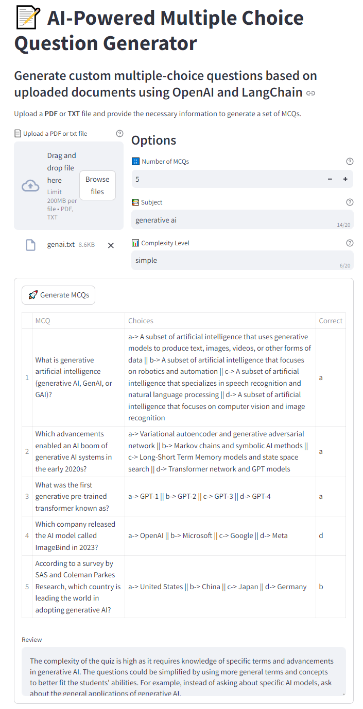

# AI-Powered MCQ Generator with OpenAI & LangChain

This project is an **AI-powered application** that generates custom multiple-choice questions (MCQs) using **OpenAI's GPT models** and **LangChain**. The app analyzes user-uploaded documents (PDF or TXT) and creates MCQs based on the document's content, with adjustable complexity and subject settings.

## Technologies Used

- **OpenAI GPT-3.5/4 API**: Used for natural language processing and question generation. GPT models analyze the uploaded documents and extract relevant content to create high-quality MCQs.
- **LangChain**: A framework that facilitates the management of multiple AI model components and data processing. LangChain was utilized to manage the interaction between the document analysis and MCQ generation processes.
- **Streamlit**: The frontend interface for the application, allowing users to upload files, specify parameters, and display results in real-time.
- **Python**: Core programming language used for backend development and API integration.

## Key Features

- **Document-Based MCQ Generation**: Upload any document in PDF or TXT format, and the app generates relevant multiple-choice questions based on the content.
- **Adjustable Difficulty**: The app allows users to set the complexity level of the MCQs (e.g., simple, intermediate, or complex).
- **Real-Time Processing**: Instant feedback and question generation using OpenAI’s capabilities.
- **Customizable Question Count**: Users can specify how many questions they want generated.

 <!-- Replace with the actual path to your screenshot -->

## How It Works

1. **Upload**: Choose a PDF or TXT document that the app will analyze.
2. **Set Parameters**: Choose the number of questions, the subject, and the complexity level.
3. **Generate MCQs**: The app uses **OpenAI's GPT model** and **LangChain** to generate relevant questions along with multiple answer choices and correct answers.
4. **View Results**: Questions and answers are displayed in a user-friendly format with an option for review.

### Example Output

| MCQ | Choices | Correct Answer |
| --- | ------- | -------------- |
| What is generative artificial intelligence (generative AI, GenAI, or GAI)? | a-> A subset of artificial intelligence that uses generative models to produce text, images, videos, or other forms of data b-> A subset of artificial intelligence that focuses on robotics and automation c-> A subset of artificial intelligence that specializes in speech recognition and natural language processing d-> A subset of artificial intelligence that focuses on computer vision and image recognition | a |
| Which advancements enabled an AI boom of generative AI systems in the early 2020s? | a-> Variational autoencoder and generative adversarial network b-> Markov chains and symbolic AI methods c-> Long-Short Term Memory models and state space search d-> Transformer network and GPT models | a |

## Technologies Breakdown

1. **OpenAI API**: Provides the core AI model (GPT-3.5/4) for natural language understanding, processing, and MCQ generation.
2. **LangChain Framework**: Coordinates the interaction between multiple AI tools and ensures that the right components are triggered at the right time in the workflow.
3. **Streamlit**: An open-source Python library used to create the web interface that allows users to upload files, choose parameters, and visualize generated MCQs.
4. **Python**: Used for backend logic, API calls, and integrating OpenAI with LangChain for the question-generation process.

## Setup and Installation

Follow these steps to set up and run the project on your local machine:

